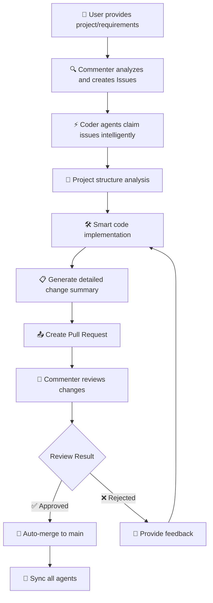
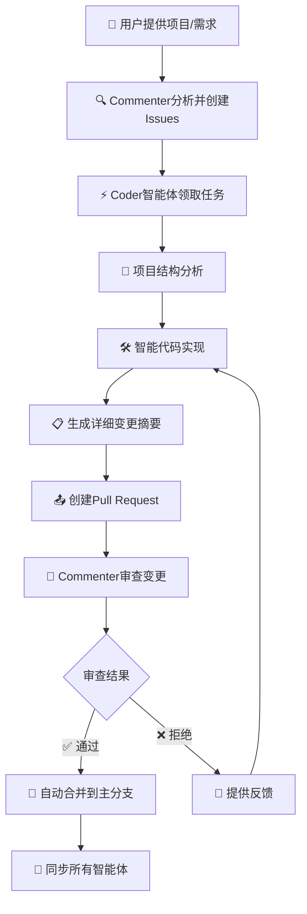

# Multi-Agent Coder

[English](#english) | [简体中文](#简体中文)

<a name="english"></a>
# Multi-Agent Coder

A sophisticated AI-powered collaborative coding system that simulates real development teams with GitHub-style workflows, intelligent code generation, and advanced project management capabilities.

## 🚀 Key Features

### 🎯 Interactive Project Setup
- **Universal Project Support**: Works with any Git repository - local projects, GitHub repos, or create new ones
- **One-Click GitHub Integration**: Automatically clone and setup GitHub repositories
- **Smart Project Detection**: Intelligently identifies and handles complex project structures
- **Auto-initialization**: Automatically sets up Git repositories and required files
- **Path Validation**: Ensures all paths are valid and accessible

### 🤖 Advanced AI Collaboration
- **Multi-Agent Architecture**: Multiple AI agents working together like a real development team
- **GitHub-Style Workflow**: Complete Pull Request workflow with code review and merging
- **Intelligent Code Generation**: Context-aware code modifications with project structure analysis
- **Real-time Collaboration**: Agents coordinate work and avoid conflicts automatically
- **Detailed Change Tracking**: See exactly what each agent modified with comprehensive summaries

### 🔧 Latest Improvements ✨
- **🌐 GitHub Repository Cloning**: Direct support for GitHub URLs with automatic cloning
- **🎯 Interactive Startup Experience**: User-friendly setup process with clear guidance
- **📁 Smart Project Detection**: Automatically detects and handles special project structures
- **🔄 Enhanced Synchronization**: Improved project content synchronization between repositories
- **📊 Detailed Modification Reports**: Comprehensive summaries of all code changes
- **⚡ Optimized Performance**: Better resource management and faster operations

### System Components

#### 🗣️ Commenter Agent
- **Project Analysis**: Analyzes project requirements and creates development tasks
- **Issue Management**: Creates, assigns, and tracks development issues
- **Code Review**: Reviews Pull Requests with AI-powered quality assessment
- **Progress Monitoring**: Tracks project progress and task completion

#### 👨‍💻 Coder Agents
- **Intelligent Implementation**: Develops features based on project analysis
- **Context-Aware Coding**: Understands project structure before making changes
- **Independent Workspaces**: Each agent has its own repository for conflict-free development
- **Quality Assurance**: Provides detailed modification summaries and change tracking

#### 🔗 Collaboration Manager
- **Workflow Orchestration**: Manages the complete development workflow
- **Conflict Resolution**: Automatically handles merge conflicts and code synchronization
- **Branch Management**: Creates, manages, and cleans up feature branches
- **Integration Control**: Coordinates work between all agents

## 🔄 Development Workflow



## 📁 Project Architecture

```
multi-agent-coder/
├── run.py                    # 🚀 Interactive main entry point
├── src/
│   └── multi_agent_coder/
│       ├── config.py         # ⚙️ System configuration
│       ├── git_utils.py      # 🔧 Git operations
│       ├── llm_utils.py      # 🤖 LLM interface
│       ├── collaboration.py  # 🤝 Collaboration manager
│       ├── multi_repo_manager.py  # 📚 Multi-repository management
│       └── agents/
│           ├── commenter.py  # 🗣️ Commenter agent
│           ├── coder.py      # 👨‍💻 Enhanced Coder agent
│           └── thinking/     # 🧠 Advanced AI capabilities
│               └── memory_manager.py
├── agent_repos/              # 🏢 Auto-created agent workspaces
│   ├── playground/           # 🎮 Main collaboration repository
│   ├── agent_coder_0/        # 👨‍💻 Coder 0 workspace
│   ├── agent_coder_1/        # 👨‍💻 Coder 1 workspace
│   └── agent_coder_2/        # 👨‍💻 Coder 2 workspace
├── .issues.json              # 📋 Issues tracking
├── README.md
├── requirements.txt
└── pyproject.toml
```

## ⚡ Quick Start

### 1. Installation

```bash
# Clone the repository
git clone https://github.com/charr-Chen/multi-agent-coder.git
cd multi-agent-coder

# Install dependencies (choose one)
pip install -r requirements.txt
# OR (recommended for faster installation)
uv sync
```

### 2. Environment Setup

```bash
# Required: Set your OpenAI API key
export OPENAI_API_KEY="your-api-key-here"

# Optional: Set proxy if needed
export OPENAI_PROXY_URL="your-proxy-url"
```

### 3. Launch the System

```bash
python run.py
```

## 🎯 Interactive Setup Experience

When you run the system, you'll see a user-friendly setup process:

```
============================================================
🚀 Multi-Agent Coder - AI Collaborative Programming System
============================================================

💡 Please specify the Git repository to use:
   - Local project path (e.g., /path/to/project)
   - GitHub repository URL (e.g., https://github.com/user/repo.git)
   - Leave empty to use current directory

📁 Git repository path or URL: 
```

### 📋 Supported Input Types

| Input Type | Example | Description |
|------------|---------|-------------|
| **Local Path** | `/home/user/my-project` | Use existing local project |
| **GitHub HTTPS** | `https://github.com/user/repo.git` | Clone from GitHub |
| **GitHub SSH** | `git@github.com:user/repo.git` | Clone via SSH |
| **Empty** | `(press Enter)` | Use current directory |

### 🌟 What Happens During Setup

1. **🔍 Path Validation**: Ensures the path/URL is valid and accessible
2. **📥 Auto-Cloning**: Automatically clones GitHub repositories to local directory
3. **🔧 Git Initialization**: Offers to initialize Git if not already a repository
4. **📋 Issues Setup**: Creates and manages the `.issues.json` file
5. **🎯 Smart Detection**: Detects special project structures (like AgentGPT)
6. **📁 Content Synchronization**: Copies project content to collaboration workspace

## 🎉 Advanced Features

### 🌐 GitHub Integration

The system seamlessly integrates with GitHub:

```bash
# When you provide a GitHub URL, the system:
# 1. Validates the repository
# 2. Clones it to a local directory
# 3. Sets up the collaboration environment
# 4. Handles naming conflicts automatically

📁 Git repository path or URL: https://github.com/microsoft/vscode.git
🌐 Detected GitHub repository: https://github.com/microsoft/vscode.git
📥 Cloning repository to: vscode
✅ Successfully cloned repository: /current/path/vscode
```

### 🧠 Smart Project Detection

The system intelligently handles different project types:

- **🎯 Complex Projects**: Detects multi-module projects and handles them appropriately
- **📦 Monorepos**: Understands monorepo structures and focuses on relevant parts
- **🔍 Reference Projects**: When run in the multi-agent-coder directory, automatically detects AgentGPT as a reference project
- **📁 Empty Projects**: Handles new/empty repositories by setting up basic structure

### 📊 Detailed Change Tracking

Every code modification includes comprehensive information:

```
================================================================================
📋 【Code Modification Summary】- coder_0
================================================================================
🎯 Processed Issue: Add user authentication system
📝 Issue Description: Implement JWT-based authentication with login/logout...
📂 Modified Files: 
   - src/auth/auth_service.py (+45 lines)
   - src/middleware/auth_middleware.py (+32 lines)
   - tests/test_auth.py (+28 lines)
📊 Project Impact:
   ✅ Added 3 new files
   🔧 Modified 0 existing files
   ➕ Total lines added: 105
🔍 Code Structure:
   📁 Classes: 3 new
      - class AuthService
      - class AuthMiddleware  
      - class TestAuth
   ⚙️ Functions: 8 new
      - def authenticate_user()
      - def generate_jwt_token()
      - def validate_token()
      ...
🤖 AI Summary:
   - Implemented complete JWT-based authentication system
   - Added secure token generation and validation
   - Included comprehensive unit tests
   - Follows security best practices
📝 Git Commit: 'feat: Add JWT authentication system'
================================================================================
```

## ⚙️ Configuration

### System Configuration

Edit `src/multi_agent_coder/config.py`:

```python
SYSTEM_CONFIG = {
    "use_separate_repos": True,      # Multi-repository mode (recommended)
    "num_coders": 3,                 # Number of Coder agents
    "playground_repo": "",           # Main collaboration repository
    "agent_repos_dir": "agent_repos" # Agent repositories directory
}
```

### Environment Variables

```bash
# Core settings
export OPENAI_API_KEY="your-api-key"
export OPENAI_PROXY_URL="proxy-url"  # Optional

# Advanced settings
export USE_SEPARATE_REPOS="true"     # Enable multi-repo mode
export NUM_CODERS="3"                # Number of coding agents
export REPO_PATH="/path/to/project"  # Override project path
```

## 📊 Monitoring & Status

### Pull Request Lifecycle
- `🔄 open`: Awaiting review
- `✅ approved`: Review passed, ready to merge
- `❌ rejected`: Review failed, needs changes
- `🔀 merged`: Successfully integrated

### Issue Management
- `📋 open`: Available for assignment
- `👨‍💻 assigned`: Being worked on by an agent
- `👀 review`: Code review in progress
- `✅ completed`: Task finished successfully

## 🛠️ Advanced Capabilities

### 🎯 Intelligent Code Generation
- **Context Awareness**: Understands project structure and coding patterns
- **Quality Assurance**: Follows best practices and coding standards
- **Error Handling**: Includes proper error handling and edge cases
- **Documentation**: Generates appropriate comments and documentation

### 🔄 Multi-Repository Synchronization
- **Conflict Prevention**: Agents work in isolated environments
- **Smart Merging**: Automatic conflict resolution with human oversight
- **Content Sync**: Keeps all repositories up-to-date with latest changes
- **Rollback Support**: Easy rollback if issues arise

### 📈 Performance Optimization
- **Parallel Processing**: Multiple agents work simultaneously
- **Resource Management**: Efficient use of API calls and system resources
- **Caching**: Intelligent caching of project analysis and context
- **Background Tasks**: Non-blocking operations for better responsiveness

## 🔧 Dependencies

- **Python 3.9+**: Modern Python features and performance
- **GitPython**: Git operations and repository management
- **OpenAI**: LLM interface for AI capabilities
- **AsyncIO**: Asynchronous programming for better performance
- **Pydantic**: Data validation and settings management
- **Coloredlogs**: Enhanced logging with colors
- **Aiofiles**: Asynchronous file operations

## 🎯 Best Practices

### Project Setup
- Use descriptive repository names
- Include a clear project description
- Ensure proper Git configuration
- Set up appropriate .gitignore files

### Issue Creation
- Write clear, actionable requirements
- Include specific acceptance criteria
- Provide context and examples
- Break down complex tasks

### Code Quality
- Follow language-specific conventions
- Include comprehensive tests
- Add meaningful comments
- Handle errors gracefully

## 🚨 Troubleshooting

### Common Issues & Solutions

#### 🔑 API Key Issues
```bash
# Error: "❌ OpenAI API key not set"
export OPENAI_API_KEY="your-actual-api-key"
```

#### 🌐 Network Connectivity
```bash
# For proxy environments
export OPENAI_PROXY_URL="http://proxy-server:port"
```

#### 📁 Permission Issues
```bash
# Ensure write permissions
chmod -R 755 /path/to/project
```

#### 🔧 Git Configuration
```bash
# Set up Git user information
git config --global user.name "Your Name"
git config --global user.email "your.email@example.com"
```

### Performance Tips

1. **🚀 Use Multi-Repo Mode**: Better performance and conflict avoidance
2. **⚡ Optimize API Usage**: Monitor and optimize API call frequency
3. **💾 Manage Disk Space**: Multi-repo mode uses more disk space
4. **🔄 Regular Cleanup**: Periodically clean up old branches and repositories

## 🔮 Roadmap

### Near Term (Next Release)
- [ ] 🌍 Multi-language support (JavaScript, TypeScript, Java)
- [ ] 🔌 Plugin system for custom tools
- [ ] 📊 Web dashboard for monitoring
- [ ] 🔄 Automatic dependency management

### Medium Term
- [ ] ☁️ Cloud deployment options
- [ ] 🔗 Integration with popular IDEs
- [ ] 📈 Advanced analytics and reporting
- [ ] 🤖 Custom AI model support

### Long Term
- [ ] 🌐 Distributed agent network
- [ ] 🎯 Industry-specific templates
- [ ] 🔒 Enterprise security features
- [ ] 📱 Mobile app for monitoring

## 🤝 Contributing

We welcome contributions from the community! Please see our [Contributing Guidelines](CONTRIBUTING.md) for details.

### Development Setup

```bash
# Fork and clone the repository
git clone https://github.com/your-username/multi-agent-coder.git

# Create a virtual environment
python -m venv venv
source venv/bin/activate  # On Windows: venv\Scripts\activate

# Install development dependencies
pip install -r requirements-dev.txt

# Run tests
python -m pytest
```

## 📄 License

This project is licensed under the MIT License - see the [LICENSE](LICENSE) file for details.

---

<a name="简体中文"></a>
# Multi-Agent Coder

基于AI的智能协作编程系统，模拟真实开发团队的工作流程，提供GitHub风格的协作体验和智能代码生成能力。

## 🚀 核心特性

### 🎯 交互式项目配置
- **通用项目支持**: 支持任何Git仓库 - 本地项目、GitHub仓库或创建新项目
- **一键GitHub集成**: 自动克隆和配置GitHub仓库
- **智能项目检测**: 智能识别和处理复杂项目结构
- **自动初始化**: 自动设置Git仓库和必要文件
- **路径验证**: 确保所有路径有效且可访问

### 🤖 高级AI协作
- **多智能体架构**: 多个AI智能体像真实开发团队一样协作
- **GitHub风格工作流**: 完整的Pull Request工作流程，包括代码审查和合并
- **智能代码生成**: 基于项目结构分析的上下文感知代码修改
- **实时协作**: 智能体自动协调工作并避免冲突
- **详细变更追踪**: 清楚显示每个智能体的修改内容和全面摘要

### 🔧 最新改进 ✨
- **🌐 GitHub仓库克隆**: 直接支持GitHub URL并自动克隆
- **🎯 交互式启动体验**: 用户友好的设置过程，提供清晰指导
- **📁 智能项目检测**: 自动检测和处理特殊项目结构
- **🔄 增强同步**: 改进仓库间项目内容同步
- **📊 详细修改报告**: 所有代码变更的全面摘要
- **⚡ 性能优化**: 更好的资源管理和更快的操作速度

## 🔄 开发工作流程



## ⚡ 快速开始

### 1. 安装

```bash
# 克隆仓库
git clone https://github.com/charr-Chen/multi-agent-coder.git
cd multi-agent-coder

# 安装依赖（选择一种）
pip install -r requirements.txt
# 或者（推荐，更快的安装速度）
uv sync
```

### 2. 环境配置

```bash
# 必需：设置OpenAI API密钥
export OPENAI_API_KEY="your-api-key-here"

# 可选：如需要代理
export OPENAI_PROXY_URL="your-proxy-url"
```

### 3. 启动系统

```bash
python run.py
```

## 🎯 交互式配置体验

运行系统时，您将看到用户友好的配置过程：

```
============================================================
🚀 Multi-Agent Coder - 智能体协作编程系统
============================================================

💡 请指定你要使用的Git仓库：
   - 本地项目路径（如：/path/to/project）
   - GitHub仓库URL（如：https://github.com/user/repo.git）
   - 留空使用当前目录

📁 Git仓库路径或URL: 
```

### 📋 支持的输入类型

| 输入类型 | 示例 | 说明 |
|----------|------|------|
| **本地路径** | `/home/user/my-project` | 使用现有本地项目 |
| **GitHub HTTPS** | `https://github.com/user/repo.git` | 从GitHub克隆 |
| **GitHub SSH** | `git@github.com:user/repo.git` | 通过SSH克隆 |
| **空输入** | `(按回车)` | 使用当前目录 |

### 🌟 配置过程详解

1. **🔍 路径验证**: 确保路径/URL有效且可访问
2. **📥 自动克隆**: 自动克隆GitHub仓库到本地目录
3. **🔧 Git初始化**: 如果不是Git仓库，提供初始化选项
4. **📋 Issues配置**: 创建和管理`.issues.json`文件
5. **🎯 智能检测**: 检测特殊项目结构（如AgentGPT）
6. **📁 内容同步**: 复制项目内容到协作工作空间

## 🎉 高级功能

### 🌐 GitHub集成

系统与GitHub无缝集成：

```bash
# 当您提供GitHub URL时，系统会：
# 1. 验证仓库
# 2. 克隆到本地目录
# 3. 设置协作环境
# 4. 自动处理命名冲突

📁 Git仓库路径或URL: https://github.com/microsoft/vscode.git
🌐 检测到GitHub仓库: https://github.com/microsoft/vscode.git
📥 克隆仓库到: vscode
✅ 成功克隆仓库: /current/path/vscode
```

### 📊 详细变更追踪

每次代码修改都包含全面信息：

```
================================================================================
📋 【代码修改摘要】- coder_0
================================================================================
🎯 处理的Issue: 添加用户认证系统
📝 Issue描述: 实现基于JWT的认证系统，包含登录/登出功能...
📂 修改的文件: 
   - src/auth/auth_service.py (+45 行)
   - src/middleware/auth_middleware.py (+32 行)
   - tests/test_auth.py (+28 行)
📊 项目影响:
   ✅ 新增 3 个文件
   🔧 修改 0 个现有文件
   ➕ 总计新增行数: 105
🔍 代码结构:
   📁 新增类: 3 个
      - class AuthService
      - class AuthMiddleware  
      - class TestAuth
   ⚙️ 新增函数: 8 个
      - def authenticate_user()
      - def generate_jwt_token()
      - def validate_token()
      ...
🤖 AI摘要:
   - 实现了完整的JWT认证系统
   - 添加了安全的令牌生成和验证
   - 包含了全面的单元测试
   - 遵循安全最佳实践
📝 Git提交: 'feat: 添加JWT认证系统'
================================================================================
```

## ⚙️ 配置选项

### 系统配置

编辑 `src/multi_agent_coder/config.py`：

```python
SYSTEM_CONFIG = {
    "use_separate_repos": True,      # 多仓库模式（推荐）
    "num_coders": 3,                 # Coder智能体数量
    "playground_repo": "",           # 主协作仓库
    "agent_repos_dir": "agent_repos" # 智能体仓库目录
}
```

### 环境变量

```bash
# 核心设置
export OPENAI_API_KEY="your-api-key"
export OPENAI_PROXY_URL="proxy-url"  # 可选

# 高级设置
export USE_SEPARATE_REPOS="true"     # 启用多仓库模式
export NUM_CODERS="3"                # 编码智能体数量
export REPO_PATH="/path/to/project"  # 覆盖项目路径
```

## 🔧 依赖项

- **Python 3.9+**: 现代Python特性和性能
- **GitPython**: Git操作和仓库管理
- **OpenAI**: AI功能的LLM接口
- **AsyncIO**: 异步编程，提供更好性能
- **Pydantic**: 数据验证和设置管理
- **Coloredlogs**: 彩色增强日志
- **Aiofiles**: 异步文件操作

## 🚨 故障排除

### 常见问题及解决方案

#### 🔑 API密钥问题
```bash
# 错误："❌ OpenAI API密钥未设置"
export OPENAI_API_KEY="your-actual-api-key"
```

#### 🌐 网络连接问题
```bash
# 代理环境
export OPENAI_PROXY_URL="http://proxy-server:port"
```

#### 📁 权限问题
```bash
# 确保写入权限
chmod -R 755 /path/to/project
```

#### 🔧 Git配置
```bash
# 设置Git用户信息
git config --global user.name "Your Name"
git config --global user.email "your.email@example.com"
```

## 🔮 发展路线

### 近期（下个版本）
- [ ] 🌍 多语言支持（JavaScript、TypeScript、Java）
- [ ] 🔌 自定义工具插件系统
- [ ] 📊 监控Web仪表板
- [ ] 🔄 自动依赖管理

### 中期
- [ ] ☁️ 云部署选项
- [ ] 🔗 流行IDE集成
- [ ] 📈 高级分析和报告
- [ ] 🤖 自定义AI模型支持

### 长期
- [ ] 🌐 分布式智能体网络
- [ ] 🎯 行业特定模板
- [ ] 🔒 企业安全功能
- [ ] 📱 监控移动应用

## 🤝 贡献

我们欢迎社区贡献！请查看我们的[贡献指南](CONTRIBUTING.md)了解详情。

## 📄 许可证

本项目采用MIT许可证 - 查看[LICENSE](LICENSE)文件了解详情。
