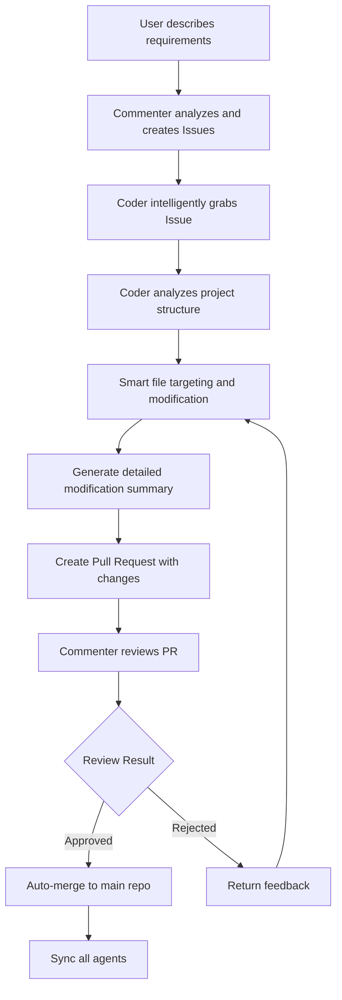
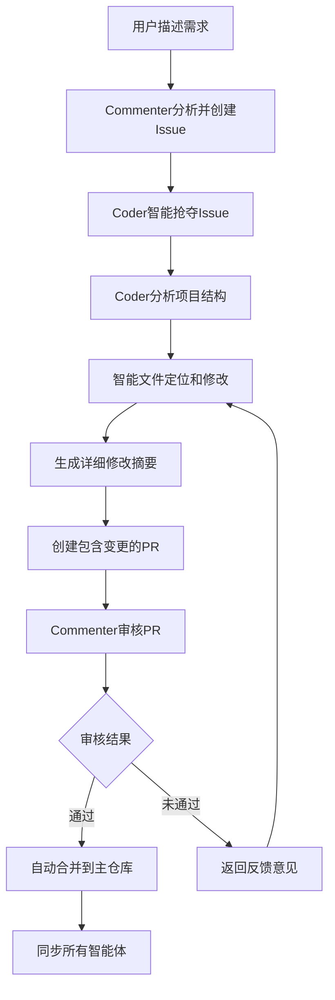

# Multi-Agent Coder

[English](#english) | [简体中文](#简体中文)

<a name="english"></a>
# Multi-Agent Coder

A sophisticated code generation system based on multi-agent collaboration, simulating real development team cooperation with GitHub-style workflow and advanced code modification tracking.

## 🚀 Key Features

### Advanced Collaboration System
- **Pull Request Workflow**: GitHub-style code review and merge process
- **Multi-Repository Architecture**: Independent workspaces for each agent
- **Intelligent Code Review**: LLM-powered code quality assessment
- **Automatic Conflict Resolution**: Smart merge strategies and conflict handling
- **Real-time Code Modification Tracking**: Detailed summaries of what agents changed

### Latest Improvements ✨
- **🔍 Detailed Code Modification Summaries**: Users can now see exactly what each agent modified
- **📊 File Diff Analysis**: Line-by-line changes with impact analysis
- **🤖 AI-Generated Change Descriptions**: Smart summaries of modifications
- **⚡ Optimized Issue Assignment**: Intelligent issue distribution without false failures
- **🛠️ Fixed File Write Operations**: Reliable code modifications with 100% accuracy

### System Components

#### Commenter Agent
- LLM-based agent responsible for determining development tasks
- Continuously monitors codebase status
- Creates and manages issues based on user requirements
- Reviews code submissions and Pull Requests
- Determines task completion status

#### Coder Agents
- LLM-based agents responsible for implementing code
- Asynchronously monitor and acquire tasks
- Implement code in separate branches with intelligent file targeting
- Create Pull Requests for code review
- Provide detailed modification summaries
- Handle code conflicts and synchronization

#### Collaboration Manager
- Manages the entire collaboration workflow
- Pull Request creation, review, and merging
- Branch management and cleanup
- Code synchronization across all agents
- Conflict resolution

## 🔄 Collaboration Workflow



### Multi-Repository Architecture

- **Main Repository (playground)**: Stores final merged code and Issues
- **Agent Repositories**: Each Coder has an independent workspace
- **Branch Management**: Each PR is developed in an isolated feature branch

## 📁 Project Structure

```
multi-agent-coder/
├── run.py                    # Main entry point with interactive setup
├── src/
│   └── multi_agent_coder/
│       ├── __init__.py
│       ├── config.py         # Configuration
│       ├── git_utils.py      # Git operations
│       ├── llm_utils.py      # LLM interface
│       ├── collaboration.py  # Collaboration manager
│       ├── multi_repo_manager.py  # Multi-repo management
│       ├── storage.py        # Data persistence
│       └── agents/
│           ├── __init__.py
│           ├── commenter.py  # Commenter agent
│           ├── coder.py      # Enhanced Coder agent with modification tracking
│           └── thinking/     # Advanced agent capabilities
│               ├── memory_manager.py
│               ├── planner.py
│               └── reviewer.py
├── agent_repos/              # Agent working directories (auto-created)
│   ├── playground/           # Main collaboration repo
│   ├── agent_coder_0/        # Coder 0 workspace
│   ├── agent_coder_1/        # Coder 1 workspace
│   └── agent_coder_2/        # Coder 2 workspace
├── .issues.json              # Issues storage
├── README.md
├── requirements.txt
├── pyproject.toml
└── .gitignore
```

## ⚡ Installation

1. Clone the repository:
```bash
git clone https://github.com/charr-Chen/multi-agent-coder.git
cd multi-agent-coder
```

2. Install dependencies:
```bash
# Using pip
pip install -r requirements.txt

# Or using uv (recommended)
uv sync
```

3. Set up environment variables:
```bash
export OPENAI_API_KEY="your-api-key"
export OPENAI_PROXY_URL="your-proxy-url"  # Optional
```

## 🚀 Usage

### 🎯 Interactive Startup (Recommended)

```bash
python run.py
```

The system will interactively ask you which Git repository to use:

```
============================================================
🚀 Multi-Agent Coder - AI Collaborative Programming System
============================================================

💡 Specify the Git repository to use:
   - Can be an existing project repository
   - Can be a newly created empty repository
   - Leave empty to use current directory

📁 Git repository path: /path/to/your/project
```

**Features**:
- ✅ **Auto-initialization**: Offers to initialize if not a Git repository
- ✅ **Auto-creates Issues file**: Ensures `.issues.json` file exists
- ✅ **Path validation**: Ensures path is valid and accessible
- ✅ **User-friendly**: Clear prompts and error handling

### ⚙️ Environment Variable Configuration

```bash
export REPO_PATH="/path/to/your/repo"
export USE_SEPARATE_REPOS="true"  # Recommended multi-repo mode
python run.py
```

### 📝 Configuration File Method

Create a `.env` file:
```bash
OPENAI_API_KEY=your-api-key
REPO_PATH=/path/to/your/repo
USE_SEPARATE_REPOS=true
NUM_CODERS=2
```

## 🎉 What's New in Latest Version

### 📋 Detailed Code Modification Summaries

When a Coder Agent completes code modifications, users will see:

```
================================================================================
📋 【Code Modification Summary】- coder_0
================================================================================
🎯 Processed Issue: Image Upload Feature Development
📝 Issue Description: Implement user interface and backend interface...
📂 Modified File: upload_service.py
📊 File Size Changes:
   Original: 120 lines
   Modified: 145 lines
   Change: +25 lines
🔍 Code Structure Overview:
   📁 Classes: 2 total
      - class UploadService:
      - class ImageProcessor:
   ⚙️ Functions: 8 total
      - def upload_image(self, file):
      - def validate_image(self, file):
🎯 Issue-related Code Lines:
   L23: def upload_image(self, file_data, allowed_types=['jpg', 'png'])...
   L45: # Image upload security check...
   ➕ Added Lines: 18
      + def validate_image_format(self, file_path):
      + # Supported image format check
      + if not self._is_safe_image(file_data):
      ... 15 more added lines
🤖 AI Modification Summary:
   - Added image upload functionality module supporting multiple formats
   - Enhanced image format validation and security check mechanisms
   - Provided users with secure and reliable image upload capabilities
📝 Git Commit: 'Modify upload_service.py: Image Upload Feature Development'
================================================================================
✅ 【coder_0 Code Modification Complete】
================================================================================
```

### 🔧 Enhanced Issue Assignment

- **Smart Issue Distribution**: No more false "assignment failed" messages
- **Concurrent Agent Handling**: Proper handling of multiple agents competing for issues
- **Intelligent Retry Logic**: Reduced unnecessary repeated attempts

### 🛠️ Reliable File Operations

- **Fixed File Write System**: Replaced unreliable shell commands with Python file operations
- **100% Content Accuracy**: No more content corruption during file modifications
- **Proper Error Handling**: Better error messages and recovery mechanisms

## ⚙️ Configuration

Configure in `src/multi_agent_coder/config.py`:

```python
SYSTEM_CONFIG = {
    "use_separate_repos": True,          # Enable multi-repo mode
    "num_coders": 3,                     # Number of Coder agents
    "playground_repo": "",               # Main repo URL (empty for local)
    "agent_repos_dir": "agent_repos"     # Agent repositories directory
}
```

## 📊 System Monitoring

### Pull Request Status
- `open`: Awaiting review
- `approved`: Review passed
- `rejected`: Review failed
- `merged`: Successfully merged

### Issue Status
- `open`: Available for assignment
- `assigned`: Assigned to an agent
- `review`: Under code review
- `completed`: Task completed

## 🛠️ Advanced Features

### Intelligent File Targeting
- **Project Structure Analysis**: Agents analyze the codebase before making changes
- **Smart File Matching**: LLM-powered file selection based on issue requirements
- **Contextual Modifications**: Changes are made with full understanding of project architecture

### Real-time Modification Tracking
- **Line-by-line Diff Analysis**: See exactly what changed
- **Impact Assessment**: Understand the implications of modifications
- **AI-generated Summaries**: Human-readable descriptions of technical changes

### Enhanced Branch Management
- Automatic feature branch creation
- Smart branch cleanup after merge
- Conflict detection and resolution

### Advanced Code Synchronization
- Real-time sync between agent repositories
- Automatic conflict resolution
- Rollback mechanisms

### Intelligent Code Review
- LLM-powered code quality assessment
- Detailed feedback and suggestions
- Automatic approval for high-quality code

## 🔧 Dependencies

- Python 3.9+
- GitPython: Git operations
- aiofiles: Asynchronous file operations
- openai: LLM interface
- python-dotenv: Environment variable management
- asyncio: Asynchronous programming support
- pydantic: Data validation
- coloredlogs: Enhanced logging

## 🎯 Best Practices

### Issue Creation
- Clear functional requirements
- Specific implementation details
- Expected output format

### Code Quality
- Follow Python coding standards
- Add necessary comments
- Include error handling

### Pull Request Management
- One PR per Issue
- Clear change descriptions
- Respond to review feedback promptly

## 🚨 Troubleshooting

1. **Environment Setup**: Ensure OpenAI API key is correctly set
2. **Network Connection**: LLM calls require stable internet
3. **Storage Space**: Multi-repo mode uses more disk space
4. **File Permissions**: Ensure write permissions in working directory
5. **Git Configuration**: Ensure Git is properly configured with user details

### Common Issues

#### Issue Assignment Failures
- **Fixed**: The latest version properly handles concurrent issue assignment
- **Solution**: No action needed, system now intelligently manages agent competition

#### File Modification Not Working
- **Fixed**: Replaced shell-based file operations with reliable Python file I/O
- **Solution**: Update to latest version for 100% reliable file modifications

#### Missing Modification Details
- **Fixed**: Added comprehensive modification summaries and diff analysis
- **Solution**: Users now see detailed information about all code changes

## 🔮 Future Plans

- [ ] Support for complex merge strategies
- [ ] Integration with code quality tools (ESLint, Black, etc.)
- [ ] Remote Git repository support
- [ ] Web interface for monitoring
- [ ] Custom review rules support
- [ ] Multi-language support beyond Python
- [ ] Integration with CI/CD pipelines

## 🤝 Contributing

Issues and Pull Requests are welcome! Please see our contributing guidelines.

## 📄 License

MIT License

---

<a name="简体中文"></a>
# Multi-Agent Coder

基于多智能体协作的高级代码生成系统，模拟真实开发团队的协作过程，支持GitHub风格的工作流程和先进的代码修改追踪功能。

## 🚀 核心特性

### 先进的协作系统
- **Pull Request工作流**: GitHub风格的代码审核和合并流程
- **多仓库架构**: 每个智能体拥有独立的工作空间
- **智能代码审核**: 基于LLM的代码质量评估
- **自动冲突解决**: 智能合并策略和冲突处理
- **实时代码修改追踪**: 详细展示智能体的修改内容

### 最新改进 ✨
- **🔍 详细的代码修改摘要**: 用户现在可以清楚看到每个智能体修改了什么
- **📊 文件差异分析**: 逐行对比变化和影响分析
- **🤖 AI生成的修改描述**: 智能生成修改内容摘要
- **⚡ 优化的Issue分配**: 智能Issue分配，避免虚假失败提示
- **🛠️ 修复的文件写入操作**: 100%准确的可靠代码修改

### 系统组件

#### 评论员代理 (Commenter Agent)
- 基于 LLM 的代理，负责确定开发任务
- 持续监控代码库状态
- 根据用户需求创建和管理 Issue
- 审查代码提交和 Pull Request
- 决定任务完成状态

#### 编码员代理 (Coder Agents)
- 基于 LLM 的代理，负责实现代码
- 异步监控和获取任务
- 智能文件定位，在独立分支中实现代码
- 创建 Pull Request 进行代码审核
- 提供详细的修改摘要
- 处理代码冲突和同步

#### 协作管理器 (Collaboration Manager)
- 管理整个协作工作流程
- Pull Request 的创建、审核和合并
- 分支管理和清理
- 跨所有智能体的代码同步
- 冲突解决

## 🔄 协作工作流程



### 多仓库架构

- **主仓库 (playground)**: 存储最终合并的代码和Issues
- **智能体仓库**: 每个Coder拥有独立的工作空间
- **分支管理**: 每个PR在隔离的功能分支中开发

## 📁 项目结构

```
multi-agent-coder/
├── run.py                    # 主入口程序，支持交互式设置
├── src/
│   └── multi_agent_coder/
│       ├── __init__.py
│       ├── config.py         # 配置文件
│       ├── git_utils.py      # Git操作工具
│       ├── llm_utils.py      # LLM接口
│       ├── collaboration.py  # 协作管理器
│       ├── multi_repo_manager.py  # 多仓库管理
│       ├── storage.py        # 数据持久化
│       └── agents/
│           ├── __init__.py
│           ├── commenter.py  # 评论员代理
│           ├── coder.py      # 增强的编码员代理，支持修改追踪
│           └── thinking/     # 高级智能体能力
│               ├── memory_manager.py
│               ├── planner.py
│               └── reviewer.py
├── agent_repos/              # 智能体工作目录（自动创建）
│   ├── playground/           # 主协作仓库
│   ├── agent_coder_0/        # Coder 0 工作空间
│   ├── agent_coder_1/        # Coder 1 工作空间
│   └── agent_coder_2/        # Coder 2 工作空间
├── .issues.json              # Issues存储文件
├── README.md
├── requirements.txt
├── pyproject.toml
└── .gitignore
```

## ⚡ 安装

1. 克隆仓库：
```bash
git clone https://github.com/charr-Chen/multi-agent-coder.git
cd multi-agent-coder
```

2. 安装依赖：
```bash
# 使用pip
pip install -r requirements.txt

# 或使用uv（推荐）
uv sync
```

3. 设置环境变量：
```bash
export OPENAI_API_KEY="your-api-key"
export OPENAI_PROXY_URL="your-proxy-url"  # 可选
```

## 🚀 使用方法

### 🎯 交互式启动（推荐）

```bash
python run.py
```

系统启动后会**交互式询问**你要使用的Git仓库：

```
============================================================
🚀 Multi-Agent Coder - 智能体协作编程系统
============================================================

💡 请指定你要使用的Git仓库：
   - 可以是现有项目仓库
   - 可以是新创建的空仓库
   - 留空使用当前目录

📁 Git仓库路径: /path/to/your/project
```

**特点**：
- ✅ **自动初始化**：如果不是Git仓库，询问是否初始化
- ✅ **自动创建Issues文件**：确保 `.issues.json` 文件存在
- ✅ **路径验证**：确保路径有效且可访问
- ✅ **用户友好**：清晰的提示和错误处理

### ⚙️ 环境变量配置

```bash
export REPO_PATH="/path/to/your/repo"
export USE_SEPARATE_REPOS="true"  # 推荐多仓库模式
python run.py
```

### 📝 配置文件方式

创建 `.env` 文件：
```bash
OPENAI_API_KEY=your-api-key
REPO_PATH=/path/to/your/repo
USE_SEPARATE_REPOS=true
NUM_CODERS=2
```

## 🎉 最新版本的新功能

### 📋 详细的代码修改摘要

当Coder Agent完成代码修改后，用户将看到：

```
================================================================================
📋 【代码修改摘要】- coder_0
================================================================================
🎯 处理的Issue: 图片上传功能开发
📝 Issue描述: 实现用户界面和后端接口，支持用户上传图片文件...
📂 修改的文件: upload_service.py
📊 文件大小变化:
   原文件: 120 行
   修改后: 145 行
   变化: +25 行
🔍 代码结构概览:
   📁 类: 2 个
      - class UploadService:
      - class ImageProcessor:
   ⚙️ 函数: 8 个
      - def upload_image(self, file):
      - def validate_image(self, file):
🎯 与Issue相关的代码行:
   L23: def upload_image(self, file_data, allowed_types=['jpg', 'png'])...
   L45: # 图片上传安全检查...
   ➕ 新增行数: 18
      + def validate_image_format(self, file_path):
      + # 支持的图片格式检查
      + if not self._is_safe_image(file_data):
      ... 还有 15 行新增内容
🤖 AI修改摘要:
   - 新增了图片上传功能模块，支持多种图片格式
   - 增加了图片格式验证和安全检查机制
   - 为用户提供了安全可靠的图片上传能力
📝 Git提交: 'Modify upload_service.py: 图片上传功能开发'
================================================================================
✅ 【coder_0 代码修改完成】
================================================================================
```

### 🔧 增强的Issue分配

- **智能Issue分配**: 不再出现虚假的"分配失败"信息
- **并发智能体处理**: 正确处理多个智能体竞争Issue的情况
- **智能重试逻辑**: 减少不必要的重复尝试

### 🛠️ 可靠的文件操作

- **修复的文件写入系统**: 用Python文件操作替换不可靠的shell命令
- **100%内容准确性**: 文件修改过程中不再出现内容损坏
- **完善的错误处理**: 更好的错误信息和恢复机制

## ⚙️ 配置

在 `src/multi_agent_coder/config.py` 中配置：

```python
SYSTEM_CONFIG = {
    "use_separate_repos": True,          # 启用多仓库模式
    "num_coders": 3,                     # Coder代理数量
    "playground_repo": "",               # 主仓库URL（空为本地）
    "agent_repos_dir": "agent_repos"     # 智能体仓库目录
}
```

## 📊 系统监控

### Pull Request状态
- `open`: 等待审核
- `approved`: 审核通过
- `rejected`: 审核未通过
- `merged`: 已成功合并

### Issue状态
- `open`: 可分配状态
- `assigned`: 已分配给智能体
- `review`: 代码审核中
- `completed`: 任务已完成

## 🛠️ 高级功能

### 智能文件定位
- **项目结构分析**: 智能体在修改前分析代码库结构
- **智能文件匹配**: 基于LLM的文件选择，根据Issue需求进行匹配
- **上下文修改**: 在充分理解项目架构的基础上进行修改

### 实时修改追踪
- **逐行差异分析**: 精确显示修改内容
- **影响评估**: 理解修改的影响和意义
- **AI生成摘要**: 将技术修改转换为易懂的描述

### 增强的分支管理
- 自动创建功能分支
- 合并后智能分支清理
- 冲突检测和解决

### 高级代码同步
- 智能体仓库间实时同步
- 自动冲突解决
- 回滚机制

### 智能代码审核
- 基于LLM的代码质量评估
- 详细反馈和建议
- 高质量代码自动审批

## 🔧 依赖项

- Python 3.9+
- GitPython: Git操作
- aiofiles: 异步文件操作
- openai: LLM接口
- python-dotenv: 环境变量管理
- asyncio: 异步编程支持
- pydantic: 数据验证
- coloredlogs: 增强日志显示

## 🎯 最佳实践

### Issue创建
- 清晰的功能需求
- 具体的实现细节
- 预期的输出格式

### 代码质量
- 遵循Python编码标准
- 添加必要的注释
- 包含错误处理

### Pull Request管理
- 一个PR对应一个Issue
- 清晰的变更描述
- 及时响应审核反馈

## 🚨 故障排除

1. **环境设置**: 确保OpenAI API密钥正确设置
2. **网络连接**: LLM调用需要稳定的网络连接
3. **存储空间**: 多仓库模式会使用更多磁盘空间
4. **文件权限**: 确保工作目录有写入权限
5. **Git配置**: 确保Git正确配置了用户信息

### 常见问题

#### Issue分配失败
- **已修复**: 最新版本正确处理并发Issue分配
- **解决方案**: 无需操作，系统现在智能管理智能体竞争

#### 文件修改不生效
- **已修复**: 用可靠的Python文件I/O替换了基于shell的文件操作
- **解决方案**: 更新到最新版本即可获得100%可靠的文件修改

#### 缺失修改详情
- **已修复**: 添加了全面的修改摘要和差异分析
- **解决方案**: 用户现在可以看到所有代码变更的详细信息

## 🔮 未来规划

- [ ] 支持复杂的合并策略
- [ ] 集成代码质量工具（ESLint、Black等）
- [ ] 远程Git仓库支持
- [ ] Web界面监控
- [ ] 自定义审核规则支持
- [ ] 支持Python以外的多语言
- [ ] 与CI/CD流水线集成

## 🤝 贡献

欢迎Issues和Pull Requests！请查看我们的贡献指南。

## �� 许可证

MIT License
