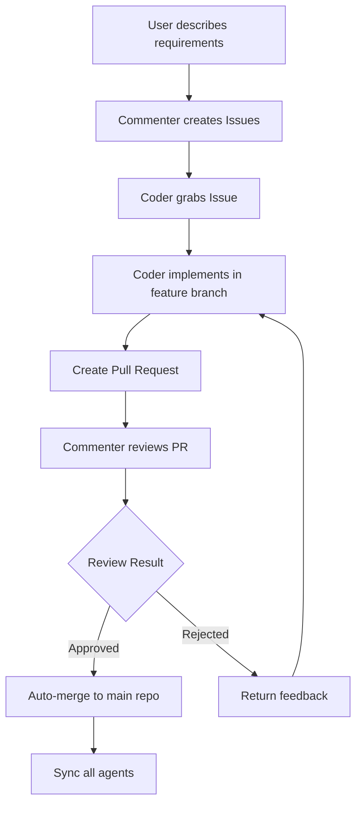
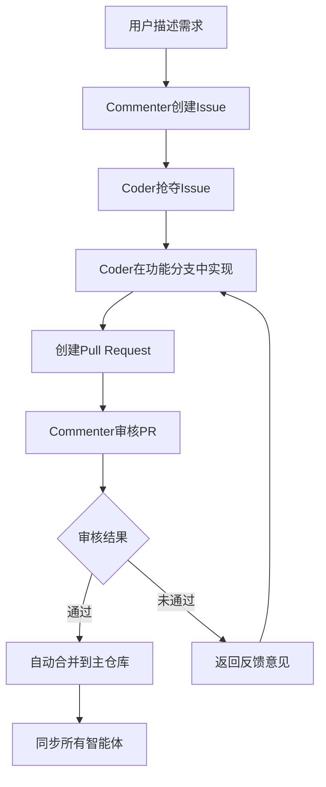

# Multi-Agent Coder

[English](#english) | [简体中文](#简体中文)

<a name="english"></a>
# Multi-Agent Coder

A code generation system based on multi-agent collaboration, simulating real development team cooperation with GitHub-style workflow.

## 🚀 Key Features

### Advanced Collaboration System
- **Pull Request Workflow**: GitHub-style code review and merge process
- **Multi-Repository Architecture**: Independent workspaces for each agent
- **Intelligent Code Review**: LLM-powered code quality assessment
- **Automatic Conflict Resolution**: Smart merge strategies and conflict handling

### System Components

#### Commenter Agent
- LLM-based agent responsible for determining development tasks
- Continuously monitors codebase status
- Creates and manages issues
- Reviews code submissions and Pull Requests
- Determines task completion status

#### Coder Agents
- LLM-based agents responsible for implementing code
- Asynchronously monitor and acquire tasks
- Implement code in separate branches
- Create Pull Requests for code review
- Handle code conflicts and synchronization

#### Collaboration Manager
- Manages the entire collaboration workflow
- Pull Request creation, review, and merging
- Branch management and cleanup
- Code synchronization across all agents
- Conflict resolution

## 🔄 Collaboration Workflow



### Multi-Repository Architecture

- **Main Repository (playground)**: Stores final merged code and Issues
- **Agent Repositories**: Each Coder has an independent workspace
- **Branch Management**: Each PR is developed in an isolated feature branch

## 📁 Project Structure

```
multi-agent-coder/
├── run.py                    # Main entry point
├── test_collaboration.py     # Collaboration system tests
├── src/
│   └── multi_agent_coder/
│       ├── __init__.py
│       ├── config.py         # Configuration
│       ├── git_utils.py      # Git operations
│       ├── llm_utils.py      # LLM interface
│       ├── collaboration.py  # Collaboration manager
│       ├── multi_repo_manager.py  # Multi-repo management
│       └── agents/
│           ├── __init__.py
│           ├── commenter.py  # Commenter agent
│           └── coder.py      # Coder agent
├── agent_repos/              # Agent working directories
│   ├── playground/           # Main collaboration repo
│   ├── agent_coder_0/        # Coder 0 workspace
│   ├── agent_coder_1/        # Coder 1 workspace
│   └── agent_coder_2/        # Coder 2 workspace
├── README.md
├── requirements.txt
└── .gitignore
```

## ⚡ Installation

1. Clone the repository:
```bash
git clone https://github.com/charr-Chen/multi-agent-coder.git
cd multi-agent-coder
```

2. Install dependencies:
```bash
pip install -r requirements.txt
```

3. Set up environment variables:
```bash
export OPENAI_API_KEY="your-api-key"
export OPENAI_PROXY_URL="your-proxy-url"  # Optional
```

## 🚀 Usage

### 1. Start the Collaboration System

```bash
python run.py
```

### 2. Test the System

```bash
# Run collaboration tests
python test_collaboration.py
```

### 3. Interactive Mode

When the system starts, you can:
- Input requirements to the Commenter agent
- Watch as Issues are created automatically
- Observe real-time code development and review
- Monitor Pull Request workflow

## 🔧 关于 test_collaboration.py 文件

### 📋 文件作用
`test_collaboration.py` 是一个**独立的测试脚本**，用于验证多智能体协作系统是否正常工作。

### ✨ 主要功能
- **验证系统健康状态** - 检查所有组件是否正常运行
- **测试协作流程** - 验证Issue创建、PR审核、代码合并等完整流程
- **故障排除工具** - 当系统出现问题时，可以快速定位问题所在
- **配置验证** - 确认API密钥、网络连接等配置是否正确
- **学习参考** - 通过阅读测试代码了解系统各组件的使用方法

### 🎯 使用场景
```bash
# 验证系统是否正常工作
python test_collaboration.py

# 排查问题时的调试工具
python test_collaboration.py  # 查看详细的执行日志

# 首次部署时的验证
python test_collaboration.py  # 确保环境配置正确
```

### 🤔 是否需要保留？

#### ✅ **推荐保留的原因**：
- **完全独立** - 不影响主程序运行
- **故障排除** - 遇到问题时的有力工具
- **配置验证** - 快速验证环境是否正确
- **占用极小** - 文件很小，几乎不占用空间
- **学习价值** - 帮助理解系统工作原理

#### ❌ **可以删除的情况**：
- 系统运行稳定，确认不再需要调试
- 希望保持项目目录的绝对简洁
- 对系统工作原理已经完全熟悉

#### 🗑️ **如何删除**：
```bash
# 如果确定不需要，可以安全删除
rm test_collaboration.py
```

> **💡 建议**：如果你是首次使用或者在生产环境部署，建议**保留**此文件。它是一个非常有用的故障排除和验证工具，在遇到问题时能够快速帮你定位问题。

## ⚙️ Configuration

Configure in `src/multi_agent_coder/config.py`:

```python
SYSTEM_CONFIG = {
    "use_separate_repos": True,          # Enable multi-repo mode
    "num_coders": 3,                     # Number of Coder agents
    "playground_repo": "",               # Main repo URL (empty for local)
    "agent_repos_dir": "agent_repos"     # Agent repositories directory
}
```

## 📊 System Monitoring

### Pull Request Status
- `open`: Awaiting review
- `approved`: Review passed
- `rejected`: Review failed
- `merged`: Successfully merged

### Issue Status
- `open`: Available for assignment
- `assigned`: Assigned to an agent
- `review`: Under code review
- `completed`: Task completed

## 🛠️ Advanced Features

### Branch Management
- Automatic feature branch creation
- Smart branch cleanup after merge
- Conflict detection and resolution

### Code Synchronization
- Real-time sync between agent repositories
- Automatic conflict resolution
- Rollback mechanisms

### Intelligent Code Review
- LLM-powered code quality assessment
- Detailed feedback and suggestions
- Automatic approval for high-quality code

## 🔧 Dependencies

- Python 3.9+
- GitPython: Git operations
- aiofiles: Asynchronous file operations
- openai: LLM interface
- python-dotenv: Environment variable management
- asyncio: Asynchronous programming support

## 🎯 Best Practices

### Issue Creation
- Clear functional requirements
- Specific implementation details
- Expected output format

### Code Quality
- Follow Python coding standards
- Add necessary comments
- Include error handling

### Pull Request Management
- One PR per Issue
- Clear change descriptions
- Respond to review feedback promptly

## 🚨 Troubleshooting

1. **Environment Setup**: Ensure OpenAI API key is correctly set
2. **Network Connection**: LLM calls require stable internet
3. **Storage Space**: Multi-repo mode uses more disk space
4. **Concurrency Control**: Avoid multiple agents modifying same files

## 🔮 Future Plans

- [ ] Support for complex merge strategies
- [ ] Integration with code quality tools
- [ ] Remote Git repository support
- [ ] Web interface for monitoring
- [ ] Custom review rules support

## 🤝 Contributing

Issues and Pull Requests are welcome!

## 📄 License

MIT License

---

<a name="简体中文"></a>
# Multi-Agent Coder

基于多智能体协作的代码生成系统，模拟真实开发团队的协作过程，支持GitHub风格的工作流程。

## 🚀 核心特性

### 先进的协作系统
- **Pull Request工作流**: GitHub风格的代码审核和合并流程
- **多仓库架构**: 每个智能体拥有独立的工作空间
- **智能代码审核**: 基于LLM的代码质量评估
- **自动冲突解决**: 智能合并策略和冲突处理

### 系统组件

#### 评论员代理 (Commenter Agent)
- 基于 LLM 的代理，负责确定开发任务
- 持续监控代码库状态
- 创建和管理 Issue
- 审查代码提交和 Pull Request
- 决定任务完成状态

#### 编码员代理 (Coder Agents)
- 基于 LLM 的代理，负责实现代码
- 异步监控和获取任务
- 在独立分支中实现代码
- 创建 Pull Request 进行代码审核
- 处理代码冲突和同步

#### 协作管理器 (Collaboration Manager)
- 管理整个协作工作流程
- Pull Request 的创建、审核和合并
- 分支管理和清理
- 跨所有智能体的代码同步
- 冲突解决

## 🔄 协作工作流程



### 多仓库架构

- **主仓库 (playground)**: 存储最终合并的代码和Issues
- **智能体仓库**: 每个Coder拥有独立的工作空间
- **分支管理**: 每个PR在隔离的功能分支中开发

## 📁 项目结构

```
multi-agent-coder/
├── run.py                    # 主入口程序
├── test_collaboration.py     # 协作系统测试
├── src/
│   └── multi_agent_coder/
│       ├── __init__.py
│       ├── config.py         # 配置文件
│       ├── git_utils.py      # Git操作工具
│       ├── llm_utils.py      # LLM接口
│       ├── collaboration.py  # 协作管理器
│       ├── multi_repo_manager.py  # 多仓库管理
│       └── agents/
│           ├── __init__.py
│           ├── commenter.py  # 评论员代理
│           └── coder.py      # 编码员代理
├── agent_repos/              # 智能体工作目录
│   ├── playground/           # 主协作仓库
│   ├── agent_coder_0/        # Coder 0 工作空间
│   ├── agent_coder_1/        # Coder 1 工作空间
│   └── agent_coder_2/        # Coder 2 工作空间
├── README.md
├── requirements.txt
└── .gitignore
```

## ⚡ 安装

1. 克隆仓库：
```bash
git clone https://github.com/charr-Chen/multi-agent-coder.git
cd multi-agent-coder
```

2. 安装依赖：
```bash
pip install -r requirements.txt
```

3. 设置环境变量：
```bash
export OPENAI_API_KEY="your-api-key"
export OPENAI_PROXY_URL="your-proxy-url"  # 可选
```

## 🚀 使用方法

### 🎯 方式1：交互式启动（推荐，最简单）

```bash
python run.py
```

系统启动后会**交互式询问**你要使用的Git仓库：

```
============================================================
🚀 Multi-Agent Coder - 智能体协作编程系统
============================================================

💡 请指定你要使用的Git仓库：
   - 可以是现有项目仓库
   - 可以是新创建的空仓库
   - 留空使用当前目录

📁 Git仓库路径: /path/to/your/project
```

**特点**：
- ✅ **自动初始化**：如果不是Git仓库，询问是否初始化
- ✅ **自动创建Issues文件**：确保 `.issues.json` 文件存在
- ✅ **路径验证**：确保路径有效且可访问
- ✅ **用户友好**：清晰的提示和错误处理

### ⚙️ 方式2：环境变量配置

```bash
export REPO_PATH="/path/to/your/repo"
export USE_SEPARATE_REPOS="true"  # 推荐多仓库模式
python run.py
```

### 📝 方式3：配置文件方式

创建 `.env` 文件：
```bash
OPENAI_API_KEY=your-api-key
REPO_PATH=/path/to/your/repo
USE_SEPARATE_REPOS=true
NUM_CODERS=2
```

### 0. 初始化项目（仅方式2、3需要）

**如果使用环境变量或配置文件方式，请确保清空预设的测试Issues：**

```bash
# 清空预设Issues（避免自动生成测试代码）
echo '{"issues": []}' > .issues.json
```

> **注意**：交互式启动（方式1）会自动处理这些初始化步骤。

### 1. 高级Git仓库配置

#### 方式1：在现有仓库中运行（推荐） 🎯

```bash
# 进入你的项目仓库
cd /path/to/your/project

# 下载multi-agent-coder
git clone https://github.com/user/multi-agent-coder.git /tmp/multi-agent-coder

# 清空预设Issues
echo '{"issues": []}' > .issues.json

# 在你的项目中运行
python /tmp/multi-agent-coder/run.py
```

#### 方式2：环境变量配置 ⚙️

```bash
# 方式2a：单仓库模式（所有agents在同一仓库工作）
export REPO_PATH="/path/to/your/repo"
export USE_SEPARATE_REPOS="false"
python run.py

# 方式2b：多仓库模式（推荐，agents有独立工作空间）
export PLAYGROUND_REPO="https://github.com/user/project.git"  # 或本地路径
export USE_SEPARATE_REPOS="true"
export AGENT_REPOS_DIR="./agent_repos"
python run.py
```

#### 方式3：配置文件方式 📝

创建 `.env` 文件：
```bash
# .env 文件内容
OPENAI_API_KEY=your-api-key
OPENAI_PROXY_URL=your-proxy-url  # 可选

# Git仓库配置
REPO_PATH=/path/to/your/repo              # 单仓库模式
PLAYGROUND_REPO=https://github.com/user/project.git  # 多仓库主仓库
USE_SEPARATE_REPOS=true                   # 启用多仓库协作
AGENT_REPOS_DIR=./agent_repos            # agents工作目录
NUM_CODERS=3                             # Coder数量
```

然后运行：
```bash
python run.py
```

### 🤔 选择哪种方式？

| 方式 | 适用场景 | 优点 | 缺点 |
|------|----------|------|------|
| **方式1** | 现有项目集成 | ✅ 简单直接<br>✅ 不污染系统环境 | ❌ 需要下载到临时目录 |
| **方式2** | 临时测试 | ✅ 灵活配置<br>✅ 一次性使用 | ❌ 环境变量管理复杂 |
| **方式3** | 长期使用 | ✅ 配置持久化<br>✅ 版本控制友好 | ❌ 需要创建配置文件 |

### 2. 启动协作系统

```bash
python run.py
```

**🎉 现在支持交互式启动！**

系统启动后会友好地询问你要使用的Git仓库：

```
============================================================
🚀 Multi-Agent Coder - 智能体协作编程系统
============================================================

💡 请指定你要使用的Git仓库：
   - 可以是现有项目仓库
   - 可以是新创建的空仓库
   - 留空使用当前目录

📁 Git仓库路径: /path/to/your/project
```

✅ **自动化功能**：
- 路径验证和错误提示
- Git仓库检测和初始化询问
- Issues文件自动创建
- 用户友好的交互体验

### 2. 测试系统

```bash
# 运行协作测试
python test_collaboration.py
```

### 3. 交互模式

系统启动后，你可以：
- 向Commenter代理输入需求
- 观察Issues的自动创建
- 实时监控代码开发和审核
- 观察Pull Request工作流程

## 🔧 关于 test_collaboration.py 文件

### 📋 文件作用
`test_collaboration.py` 是一个**独立的测试脚本**，用于验证多智能体协作系统是否正常工作。

### ✨ 主要功能
- **验证系统健康状态** - 检查所有组件是否正常运行
- **测试协作流程** - 验证Issue创建、PR审核、代码合并等完整流程
- **故障排除工具** - 当系统出现问题时，可以快速定位问题所在
- **配置验证** - 确认API密钥、网络连接等配置是否正确
- **学习参考** - 通过阅读测试代码了解系统各组件的使用方法

### 🎯 使用场景
```bash
# 验证系统是否正常工作
python test_collaboration.py

# 排查问题时的调试工具
python test_collaboration.py  # 查看详细的执行日志

# 首次部署时的验证
python test_collaboration.py  # 确保环境配置正确
```

### 🤔 是否需要保留？

#### ✅ **推荐保留的原因**：
- **完全独立** - 不影响主程序运行
- **故障排除** - 遇到问题时的有力工具
- **配置验证** - 快速验证环境是否正确
- **占用极小** - 文件很小，几乎不占用空间
- **学习价值** - 帮助理解系统工作原理

#### ❌ **可以删除的情况**：
- 系统运行稳定，确认不再需要调试
- 希望保持项目目录的绝对简洁
- 对系统工作原理已经完全熟悉

#### 🗑️ **如何删除**：
```bash
# 如果确定不需要，可以安全删除
rm test_collaboration.py
```

> **💡 建议**：如果你是首次使用或者在生产环境部署，建议**保留**此文件。它是一个非常有用的故障排除和验证工具，在遇到问题时能够快速帮你定位问题。

## ⚙️ 配置

在 `src/multi_agent_coder/config.py` 中配置：

```python
SYSTEM_CONFIG = {
    "use_separate_repos": True,          # 启用多仓库模式
    "num_coders": 3,                     # Coder代理数量
    "playground_repo": "",               # 主仓库URL（空为本地）
    "agent_repos_dir": "agent_repos"     # 智能体仓库目录
}
```

## 📊 系统监控

### Pull Request状态
- `open`: 等待审核
- `approved`: 审核通过
- `rejected`: 审核未通过
- `merged`: 已成功合并

### Issue状态
- `open`: 可分配状态
- `assigned`: 已分配给智能体
- `review`: 代码审核中
- `completed`: 任务已完成

## 🛠️ 高级功能

### 分支管理
- 自动创建功能分支
- 合并后智能分支清理
- 冲突检测和解决

### 代码同步
- 智能体仓库间实时同步
- 自动冲突解决
- 回滚机制

### 智能代码审核
- 基于LLM的代码质量评估
- 详细反馈和建议
- 高质量代码自动审批

## 🔧 依赖项

- Python 3.9+
- GitPython: Git操作
